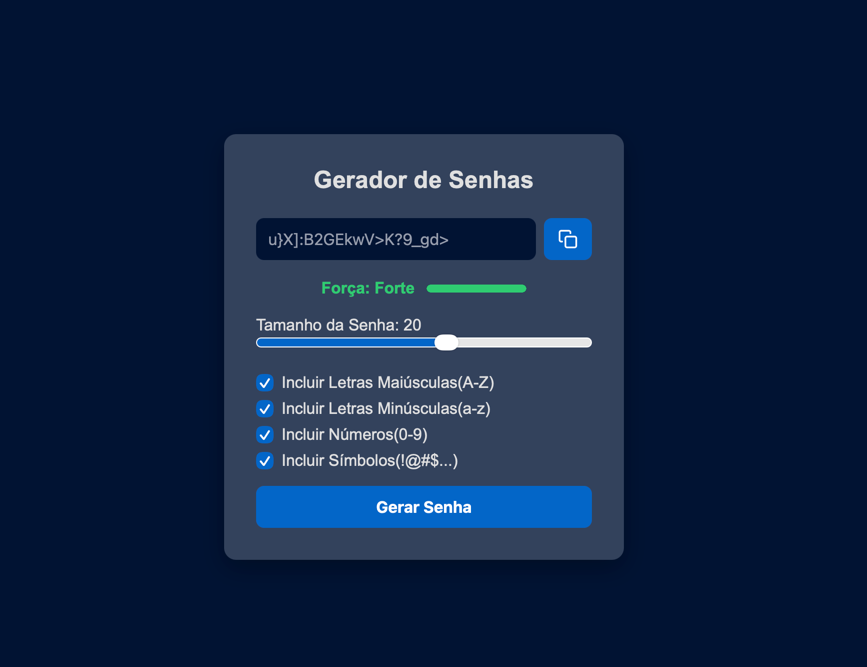

# 🔐 Gerador de Senhas

Um gerador de senhas seguras, feito com **HTML, CSS e JavaScript puro**. Permite personalizar o tamanho da senha e os tipos de caracteres incluídos, além de mostrar visualmente o nível de força da senha gerada.



## ✨ Funcionalidades

- Geração de senhas aleatórias com tamanho configurável (4 a 32 caracteres)
- Opções para incluir letras maiúsculas, minúsculas, números e símbolos
- Indicador visual de força da senha (Fraca / Média / Forte), com texto e barra coloridos
- Botão de copiar com feedback visual (ícone muda para um "check" ao copiar)
- Validações: aviso caso nenhum tipo de caractere esteja selecionado, e ao tentar copiar um campo vazio
- Layout responsivo, adaptado para dispositivos móveis

## 🛠️ Tecnologias usadas

- **HTML5** — estrutura semântica da página
- **CSS3** — estilização, variáveis (custom properties), Flexbox e media queries
- **JavaScript** — manipulação do DOM, eventos, lógica de geração de senha e Clipboard API

## 🚀 Como executar

1. Clone este repositório:
   ```bash
   git clone https://github.com/myurik/gerador-de-senhas.git
   ```
2. Abra o arquivo `index.html` no seu navegador

Não há dependências externas — é só HTML, CSS e JS puro.

## 📚 O que pratiquei neste projeto

Este foi um projeto de retomada de prática em frontend, focado em fundamentos. Alguns pontos que reforcei:

- Manipulação do DOM com `document.getElementById`, `.value`, `.textContent` e `classList`
- Lógica de programação: loops `for`, condicionais `if/else if/else`, funções com `return`
- Boas práticas: princípio DRY (evitar repetição de código, criando funções reutilizáveis como `atualizarSenha()`)
- CSS moderno: variáveis (`:root`), Flexbox para alinhamento, `accent-color`, `transition` para animações suaves
- Responsividade com media queries
- Manipulação de classes via JavaScript para alternar estilos dinamicamente (cores da barra/texto de força)
- Uso da Clipboard API (`navigator.clipboard.writeText`) com Promises (`.then`)
- `setTimeout` para criar feedback temporário (ícone de "copiado")
- Debug de problemas reais: erros de sintaxe CSS, seletores `:first-child`/`:last-child` mal aplicados, conflitos de classes CSS compartilhadas entre elementos diferentes

## 👤 Autor

Feito por [Matheus Yuri](https://github.com/myurik)

---

---

# 🔐 Password Generator

A secure password generator built with **plain HTML, CSS, and JavaScript**. Lets you customize the password length and the types of characters included, while visually displaying the strength of the generated password.


## ✨ Features

- Random password generation with configurable length (4 to 32 characters)
- Options to include uppercase letters, lowercase letters, numbers, and symbols
- Visual password strength indicator (Weak / Medium / Strong), with colored text and bar
- Copy button with visual feedback (icon switches to a checkmark on copy)
- Validations: warns if no character type is selected, and if trying to copy an empty field
- Responsive layout, adapted for mobile devices

## 🛠️ Technologies used

- **HTML5** — semantic page structure
- **CSS3** — styling, custom properties (CSS variables), Flexbox, and media queries
- **JavaScript** — DOM manipulation, events, password generation logic, and the Clipboard API

## 🚀 How to run

1. Clone this repository:
   ```bash
   git clone https://github.com/myurik/gerador-de-senhas.git
   ```
2. Open the `index.html` file in your browser

No external dependencies — just plain HTML, CSS, and JS.

## 📚 What I practiced in this project

This project was about getting back into frontend practice, with a focus on fundamentals. Some of the things I reinforced:

- DOM manipulation with `document.getElementById`, `.value`, `.textContent`, and `classList`
- Programming logic: `for` loops, `if/else if/else` conditionals, functions with `return`
- Best practices: the DRY principle (avoiding repeated code by creating reusable functions like `atualizarSenha()`)
- Modern CSS: variables (`:root`), Flexbox for alignment, `accent-color`, `transition` for smooth animations
- Responsiveness with media queries
- Dynamically toggling classes via JavaScript to switch styles (strength bar/text colors)
- Using the Clipboard API (`navigator.clipboard.writeText`) with Promises (`.then`)
- `setTimeout` to create temporary feedback (the "copied" icon)
- Debugging real issues: CSS syntax errors, misapplied `:first-child`/`:last-child` selectors, and class-name conflicts shared between different elements

## 👤 Author

Made by [Matheus Yuri](https://github.com/myurik)
